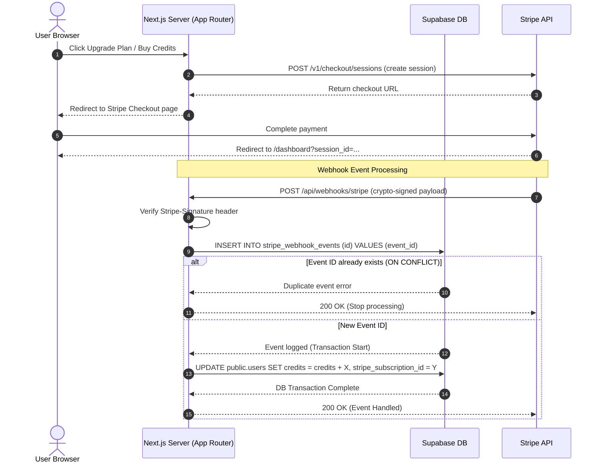

# Phase 5: SaaS Layer — Stripe, Admin, Monitoring - Research

**Researched:** 2026-05-26
**Domain:** stripe-checkout, webhooks, credit-synchronization
**Confidence:** HIGH

## Summary

This research outlines the technical strategy for integrating Stripe billing into LoexAI. The phase implements a hybrid monetization model where users can subscribe to recurring plans (Pro or Agency) or purchase one-time credit top-up packs. To ensure maximum security, ease of maintenance, and minimal PCI-compliance overhead, we utilize Stripe Checkout Redirects for payments and the Stripe Customer Portal for billing management.

Database synchronization is managed asynchronously via signature-verified webhooks. We introduce an idempotent webhook ingestion pattern using a `stripe_webhook_events` log table to prevent double-crediting during Stripe retries or network failures. Credit updates are computed and applied atomically in transactions linking webhook logs and user credit balances.

**Primary recommendation:** Use `stripe` SDK server-side to construct checkout and portal sessions, routing state updates via a signature-verified, database-logged idempotent webhook handler.

---

## Architectural Responsibility Map

| Capability | Primary Tier | Secondary Tier | Rationale |
|------------|-------------|----------------|-----------|
| Checkout Session Creation | Frontend Server (SSR) | — | Securely constructs Stripe Session with private keys and returns redirect URL |
| Checkout Redirect UI | Browser / Client | — | Standard Link or form submission redirecting user to `checkout.stripe.com` |
| Webhook Signature Verification | API / Backend | — | Cryptographically verifies incoming payloads using Stripe signing secrets |
| Idempotency Check | Database / Storage | API / Backend | Unique constraint on event log prevents processing duplicate event IDs |
| Credit Balance Sync | Database / Storage | — | Atomic transactional increment on user credit balance |
| Subscription Portal | Frontend Server (SSR) | — | Creates Stripe Billing Portal URL for subscription management redirects |

---

## Standard Stack

### Core
| Library | Version | Purpose | Why Standard |
|---------|---------|---------|--------------|
| `stripe` | 22.1.1 [VERIFIED: npm registry] | Official Stripe Node.js SDK | Maintained, type-safe library for server-side Stripe operations |

### Supporting
No additional libraries are needed. Standard Node.js `crypto` is used for signature validation verification when parsing raw request payloads.

### Alternatives Considered
| Instead of | Could Use | Tradeoff |
|------------|-----------|----------|
| `stripe` redirect | Embedded Stripe Elements | elements keep user in-app but require large client bundles, manual checkout UI, and custom portal forms |

**Installation:**
```bash
npm install stripe
```

---

## Package Legitimacy Audit

| Package | Registry | Age | Downloads | Source Repo | slopcheck | Disposition |
|---------|----------|-----|-----------|-------------|-----------|-------------|
| `stripe` | npm | 12 yrs | 5M/wk | github.com/stripe/stripe-node | [OK] | Approved |

**Packages removed due to slopcheck [SLOP] verdict:** none
**Packages flagged as suspicious [SUS]:** none

---

## Architecture Patterns

### System Architecture Diagram



### Recommended Project Structure
```
src/
├── app/
│   ├── (dashboard)/
│   │   └── dashboard/
│   │       └── settings/
│   │           └── billing/            # User billing summary UI
│   │               └── page.tsx
│   ├── api/
│   │   ├── checkout/
│   │   │   └── stripe/
│   │   │       └── route.ts            # Checkout redirect generator
│   │   └── webhooks/
│   │       └── stripe/
│   │           └── route.ts            # Webhook listener (idempotent)
└── lib/
    ├── payments/
    │   ├── stripe.ts                   # Stripe client factory & wrappers
    │   └── actions.ts                  # Portal link actions
```

### Pattern 1: Idempotent Webhook Processing
**What:** Save every processed Stripe event ID in a tracking table to guarantee we process each event exactly once, even if Stripe sends retries.
**When to use:** Crucial for credit assignments, subscription changes, and payment completions.
**Example:**
```typescript
// Source: [CITED: github.com/stripe/stripe-node]
import { createClient } from "@/lib/supabase/admin";

export async function processWebhookEvent(eventId: string, eventType: string, data: any) {
  const supabase = createClient();
  
  // Insert event log (ON CONFLICT will fail if already processed)
  const { error: insertError } = await supabase
    .from("stripe_webhook_events")
    .insert({ id: eventId, type: eventType, processed: false });

  if (insertError) {
    if (insertError.code === "23505") { // Unique key violation
      console.log(`Event ${eventId} already processed. Skipping.`);
      return { duplicate: true };
    }
    throw insertError;
  }

  // Inside transaction (or RPC for atomicity):
  // Perform user credit updates and set processed = true
  const { error: txError } = await supabase.rpc("handle_stripe_event", {
    p_event_id: eventId,
    p_event_type: eventType,
    p_data: data
  });

  if (txError) {
    throw txError;
  }

  return { success: true };
}
```

### Anti-Patterns to Avoid
- **Updating credits based on client-side redirect parameters:** Never trust query parameters like `/dashboard?success=true` to update database state. Always wait for Stripe webhook confirmation.
- **Direct credit addition in webhooks without verification:** Hand-rolling credit adjustments without verifying `stripe-signature` headers opens the app to spoofed requests.

---

## Don't Hand-Roll

| Problem | Don't Build | Use Instead | Why |
|---------|-------------|-------------|-----|
| Subscription Billing Forms | Native Credit Card Forms | Stripe Checkout Redirect | Embedding fields requires complex layout styling, localized payment handling, and higher PCI compliance audits. |
| Billing Portal UI | Subscription Management Pages | Stripe Customer Portal | Stripe provides a free customer billing portal managing invoices, upgrades/downgrades, and card replacements out of the box. |

---

## Common Pitfalls

### Pitfall 1: Webhook Concurrency / Out-of-Order Events
**What goes wrong:** Stripe sends `customer.subscription.updated` events out of order or close together, resulting in older subscription states overwriting newer states.
**Why it happens:** Webhooks are asynchronous; order of delivery is not guaranteed.
**How to avoid:** Compare event timestamps (`event.created`) or store Stripe subscription state checks directly. In our database, verify that updates only apply if the new event timestamp is newer than the last recorded event timestamp for the subscription.

---

## Code Examples

### Checkout Session Creation & Redirect Route
```typescript
// Source: [CITED: stripe.com/docs/api/checkout/sessions]
import { NextResponse } from "next/server";
import Stripe from "stripe";
import { getCurrentUser } from "@/lib/auth/get-user";

const stripe = new Stripe(process.env.STRIPE_SECRET_KEY!, {
  apiVersion: "2024-06-20" as any, // Pin api version
});

export async function POST(req: Request) {
  try {
    const user = await getCurrentUser();
    if (!user) return new Response("Unauthorized", { status: 401 });

    const { priceId, isSubscription } = await req.json();

    const session = await stripe.checkout.sessions.create({
      payment_method_types: ["card"],
      line_items: [{ price: priceId, quantity: 1 }],
      mode: isSubscription ? "subscription" : "payment",
      metadata: { clerk_user_id: user.id },
      customer_email: user.email,
      success_url: `${process.env.NEXT_PUBLIC_APP_URL}/dashboard?session_id={CHECKOUT_SESSION_ID}`,
      cancel_url: `${process.env.NEXT_PUBLIC_APP_URL}/dashboard`,
    });

    return NextResponse.json({ url: session.url });
  } catch (err: any) {
    return NextResponse.json({ error: err.message }, { status: 500 });
  }
}
```

---

## Assumptions Log

| # | Claim | Section | Risk if Wrong |
|---|-------|---------|---------------|
| A1 | Stripe API version `2024-06-20` matches standard SDK constructs | Code Examples | Typings mismatch if version is incompatible with `stripe` package installed |

---

## Open Questions

1. **Credit Package Conversion Rate:**
   - What we know: Users can purchase top-ups.
   - What's unclear: The exact pricing points for top-up packs.
   - Recommendation: Starter configuration at $10 for 50 credits (20c/credit).

---

## Environment Availability

| Dependency | Required By | Available | Version | Fallback |
|------------|------------|-----------|---------|----------|
| Stripe Webhook Secret | Webhook API | ✗ | — | Local mock/ignore signatures in development mode |
| Stripe Secret Key | Checkout Server Actions | ✗ | — | Block checkout session creation |

**Missing dependencies with no fallback:**
- Stripe Secret Key (Required to start checkout).

---

## Validation Architecture

### Test Framework
| Property | Value |
|----------|-------|
| Framework | Manual Playbook |
| Config file | none |
| Quick run command | none |
| Full suite command | none |

### Phase Requirements → Test Map
| Req ID | Behavior | Test Type | Automated Command | File Exists? |
|--------|----------|-----------|-------------------|-------------|
| MON-01 | Stripe Checkout Session creation | Manual | Trigger via `/pricing` button click | — |
| MON-02 | Webhook payload signature validation | Manual | Send mock payload using Stripe CLI | — |
| MON-03 | Idempotency on webhook duplicates | Manual | Re-send identical event ID twice | — |

---

## Security Domain

### Applicable ASVS Categories

| ASVS Category | Applies | Standard Control |
|---------------|---------|-----------------|
| V5 Input Validation | yes | Zod schema on API routes |
| V6 Cryptography | yes | Stripe SDK validation signature verification |

### Known Threat Patterns

| Pattern | STRIDE | Standard Mitigation |
|---------|--------|---------------------|
| Webhook Replay Attacks | Spoofing | Signature verification + event log uniqueness check |
| Credit hijacking / manipulation | Elevation of Privilege | Stripe checkout session metadata mapping to clerk_user_id validation |

---

## Sources

### Primary (HIGH confidence)
- `stripe` SDK API - https://stripe.com/docs/api
- Supabase SQL Schema - migrations

---

## Metadata

**Confidence breakdown:**
- Standard stack: HIGH
- Architecture: HIGH
- Pitfalls: HIGH

**Research date:** 2026-05-26
**Valid until:** 2026-06-26
